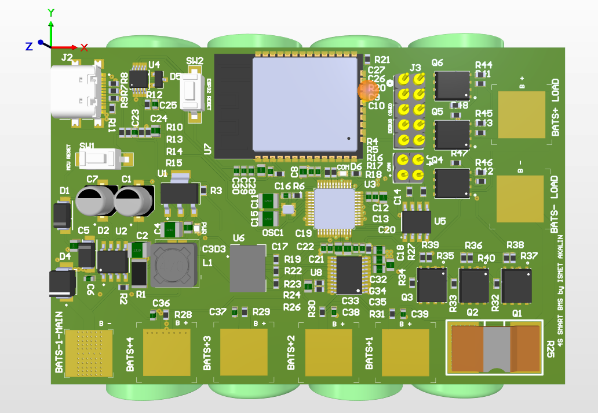
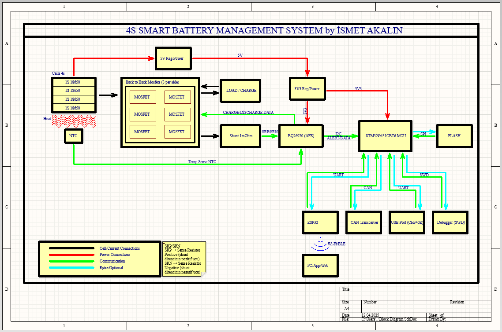

# 4S Smart Battery Management System (BMS) with STM32 & ESP32

This repository contains the hardware design files (Altium Designer) and documentation for a custom **Smart BMS** designed for 4S Li-ion battery packs. The system features a hybrid architecture using **STM32G4** for critical protection logic and **ESP32** for wireless telemetry.

## 📖 Project Overview

This project aims to create a robust, educational-grade Battery Management System capable of monitoring, balancing, and protecting a 4S configuration (16.8V max). Unlike standard analog BMS boards, this "Smart" design separates the **Analog Front End (AFE)** from the **Control Logic**, allowing for advanced SoC/SoH algorithms, data logging, and remote monitoring via Wi-Fi/BLE.

### Key Features
* **Hybrid Control Architecture:**
    * **AFE:** TI BQ76920 for precise voltage/current measurement and hardware protection.
    * **MCU:** STM32G431CBT6 for running Kalman Filter based SoC algorithms and system management.
    * **Telemetry:** ESP32-WROOM-32 for Wi-Fi/Bluetooth connectivity (IoT Dashboard ready).
* **Power Stage:** High-current path with 6x Back-to-Back MOSFETs and Low-Side Current Sensing (1mΩ Shunt).
* **Communication:** Integrated CAN FD Transceiver (MCP2562) and USB-UART (CH340E) for debugging.
* **Data Logging:** Onboard W25Q128 External Flash for storing error logs and historical battery data.

## ⚙️ Technical Specifications

| Feature | Description |
| :--- | :--- |
| **Battery Configuration** | 4S Li-ion (Nominal 14.4V, Max 16.8V) |
| **Continuous Discharge** | ~30A |
| **Peak Discharge Current** | ~50-60A |
| **Microcontroller** | STM32G431CBT6 (Cortex-M4) |
| **Analog Front End (AFE)** | TI BQ76920 (I2C Interface) |
| **Wireless Module** | ESP32-WROOM-32 (Wi-Fi + BLE) |
| **Current Sensing** | Low-Side Measurement (1mΩ Shunt Resistor) |
| **Regulators** | TPS5430 (5V Buck) & AMS1117 (3.3V LDO) |
| **Communication** | CAN Bus, USB (Serial), UART, SWD |

## 🔌 Block Diagram & Architecture

The system connects between the 4S Battery Pack and the Load/Charger.

1.  **Power & Protection Stage:** The BQ76920 constantly monitors cell voltages and current via the shunt resistor. It drives the High-Side Charge/Discharge MOSFETs directly.
2.  **Control Stage (STM32):** Reads data from the AFE via I2C, calculates State of Charge (SoC), manages passive balancing, and handles CAN bus communication.
3.  **Connectivity Stage (ESP32):** Receives data from the STM32 via UART and pushes it to a web interface or mobile app.

## ⚠️ Design Notes & Disclaimer

* **Educational Project:** This PCB was designed as part of an advanced engineering learning process to practice **Altium Designer** and **Embedded Systems** concepts.
* **Thermal Management:** For continuous high-current applications (>30A), additional cooling (heatsink) on the MOSFETs and enhanced airflow is recommended.
* **Safety:** Always test with a current-limited power supply before connecting actual lithium cells.

## 🛠️ Bill of Materials (Key Components)

* **U1 (AFE):** BQ7692000PWR
* **Uxxx (MCU):** STM32G431CBT6
* **Wireless:** ESP32-WROOM-32
* **MOSFETs:** N-Channel Power MOSFETs (Back-to-Back config)
* **Flash:** W25Q128JV (SPI)
* **CAN Tx:** MCP2562-H/SN
* **Buck Converter:** TPS5430DDA
* **Shunt:** 1mΩ High Power Resistor

## 📄 License

This project is open-source and available under the **MIT License**.
